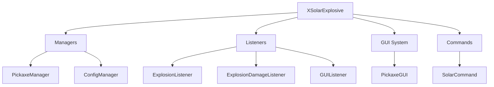

# ☀️ xSolarExplosive


**xSolarExplosive** is a premium-tier Minecraft plugin for Spigot/Paper (1.19.4+) that introduces advanced explosive pickaxes with multiple mining modes, interactive GUIs, and a sleek, modern aesthetic.

---

## 🚀 Features

- **Dual Mining Modes**:
    - **RADIUS (Cubic)**: Mining a perfect cube of blocks (3x3, 5x5, etc.) instantly.
    - **TNT (Spherical)**: A real vanilla-style explosion with particles and sound, but **0 damage to entities** and **100% block drops**.
- **Interactive GUI**: A sophisticated 54-slot administrative menu to manage and give pickaxes.
- **Support for Enchantments**: Fully compatible with both Vanilla and Custom enchantments.
- **Advanced Attributes**: Items can be set as **Unbreakable** and hide their meta flags (`HideAll`).
- **Hex Color Support**: Full support for `&#RRGGBB` hex codes and legacy `&` colors.
- **Editable Logic**: Fully configurable via `config.yml`, including a custom help message.

---

## 🛠️ Installation

1. Download the latest [xSolarExplosive-1.0.0.jar](build/libs/xSolarExplosive-1.0.0.jar).
2. Place the JAR file in your server's `plugins/` folder.
3. Restart your server to generate the configuration.
4. Customize `config.yml` and use `/solar reload` to apply changes.

---

## 📜 Commands & Permissions

| Command | Description | Permission |
|---------|-------------|------------|
| `/solar help` | Shows the custom help menu. | `xsolarexplosive.admin` |
| `/solar gui` | Opens the Pickaxe selection menu. | `xsolarexplosive.admin` |
| `/solar give <player> <id>` | Gives a specific explosive pickaxe. | `xsolarexplosive.admin` |
| `/solar reload` | Reloads the configuration and pickaxes. | `xsolarexplosive.admin` |

---

## 📂 Project Structure



---

## ⚙️ Configuration Example

```yaml
pickaxes:
  explosivo:
    display_name: "&#D0FFD3🔥 &fPico &7▸ &#D0FFD3&lEXPLOSIVO"
    material: "NETHERITE_PICKAXE"
    radius: 3 # Power of TNT/Size of Cube
    mode: "TNT" # TNT or RADIUS
    unbreakable: true
    hide_flags: true
    lore:
      - "&8| &fExploción: &#C6DEF1Standard TNT"
      - "&8| &fRareza: &4&lMÍTICO"
```

---

## 🛡️ License

Developed by **xPlugins Org**.
Copyright © 2026. All rights reserved.
Unauthorized redistribution or selling of this software is strictly prohibited.

---
**Socials:** [Discord](https://discord.gg/xplugins) | [Website](https://xplugins.es)
